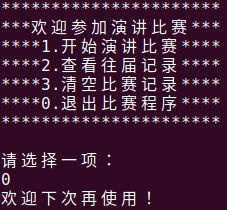
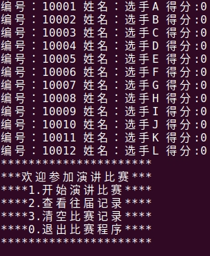
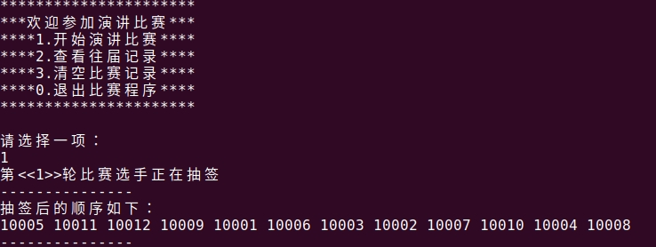
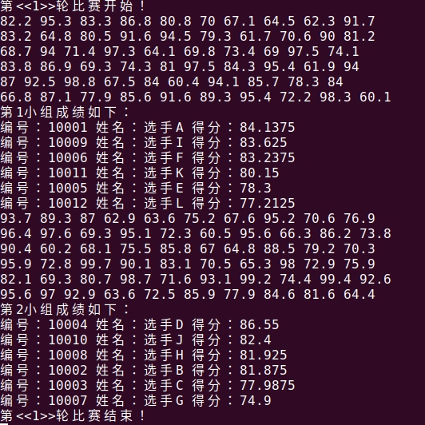
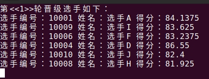
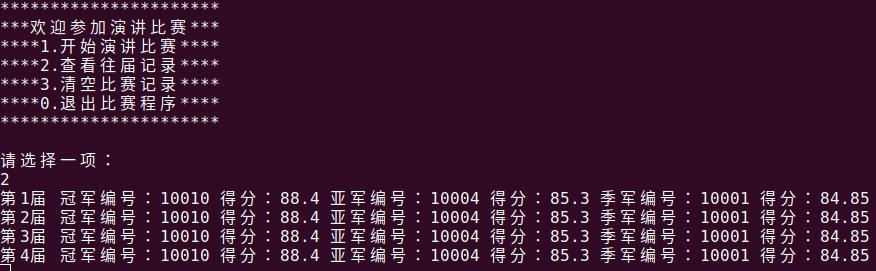

- [1.introduction](#1introduction)
- [2.SpeechManager class](#2speechmanager-class)
- [3.showMenu](#3showmenu)
- [4.exitSystem](#4exitsystem)
- [5.speech function](#5speech-function)
  - [5.1 speacker.h](#51-speackerh)
  - [5.2 create Speaker](#52-create-speaker)
  - [5.3 startSpeech](#53-startspeech)
  - [5.3 speechDraw](#53-speechdraw)
  - [5.4 speechContest](#54-speechcontest)
  - [5.5 showScore](#55-showscore)
  - [5.6 2nd showScore](#56-2nd-showscore)
  - [5.7 saveRecord](#57-saverecord)
- [6.loadRecord](#6loadrecord)
  - [6.1 load data](#61-load-data)
  - [6.2 show record data](#62-show-record-data)

# 1.introduction

&emsp;&emsp;黑马程序员的演讲比赛案例，主要应用到STL相关库中的方法。项目用到了STL中较多的功能库：vector\map\deque\string，函数有sort\accumulate\random_shuffle等等。

比赛规则如下：

- 共12人参加，比赛分两轮，第一轮为淘汰赛，第二轮为决赛；
- 每名选手都有对应的编号，如10001~10012；
- 比赛方式：分组比赛，每组6人；
- 第一轮分为两个小组，整体按照选手编号进行抽签顺序演讲；
- 十个评委分别给每名选手打分，去除最高分和最低分，求的平均分为本轮选手的成绩；
- 当小组演讲完后，淘汰组内排名最后的三个选手，前三名晋级，进入下一轮比赛；
- 第二轮为决赛，前三名胜出；
- 每轮比赛过后需要显示晋级选手的信息；

程序功能如下：
- 开始演讲比赛：完成整届比赛的流程，每个比赛阶段需要给用户一个提示，用户按任意键后进入下个阶段；
- 查看往届记录：查看之前比赛前三名的结果，每次比赛都会记录到文件中，文件用.csv后缀名保存；
- 清空比赛记录：将文件中数据清空；
- 退出比赛程序：可以退出当前程序；


# 2.SpeechManager class

功能描述：
- 提供菜单界面与 用户交互
- 对演讲比赛流程进行控制
- 与文件的读写交互

&emsp;&emsp;分别创建`speechManager.h`和`speechManager.cpp`

```cpp
#pragma once
#include <iostream>
#include <string>

class SpeechManager
{
public:
    // 构造函数
    SpeechManager();
    // 析构函数
    ~SpeechManager();
};
```

```cpp
#include "speechManager.h"

// 构造函数
SpeechManager::SpeechManager()
{
}

// 析构函数
SpeechManager::~SpeechManager()
{
}
```

# 3.showMenu

&emsp;&emsp;在`speechManager.h`中声明showMenu函数，在`speechManager.cpp`中添加实现。

```cpp
// 显示菜单
void showMenu();
```

```cpp
void SpeechManager::showMenu()
{
    std::cout << "**********************" << std::endl;
    std::cout << "***欢迎参加演讲比赛***" << std::endl;
    std::cout << "****1.开始演讲比赛****" << std::endl;
    std::cout << "****2.查看往届记录****" << std::endl;
    std::cout << "****3.清空比赛记录****" << std::endl;
    std::cout << "****0.退出比赛程序****" << std::endl;
    std::cout << "**********************" << std::endl;
    std::cout << std::endl;
}
```


# 4.exitSystem

&emsp;&emsp;添加退出系统功能！在`speechManager.h`中声明showMenu函数，在`speechManager.cpp`中添加实现。

```cpp
// 退出系统
void exitSystem();
```

```cpp
void SpeechManager::exitSystem()
{
    std::cout << "欢迎下次再使用！" << std::endl;
    exit(0);
}
```

在`main.cpp`中要添加测试，搭建用户界面框架！如下：
```cpp
int main()
{
    SpeechManager sm;
    // sm.showMenu();
    int select = 0;
    while (true)
    {
        sm.showMenu();
        std::cout << "请选择一项：" << std::endl;
        std::cin >> select;
        switch (select)
        {
        case 1:
            break;
        case 2:
            break;
        case 3:
            break;
        case 0:
            sm.exitSystem();
            break;
        default:
            break;
        }
    }
    return 0;
}
```


# 5.speech function

比赛流程分析：
抽签->开始演讲比赛->显示第一轮比赛结果->抽签->开始演讲比赛->显示前三名结果->保存分数

## 5.1 speacker.h

&emsp;&emsp;创建选手类speacher.h，包含选手姓名和选手分数，分数包含两轮的分数。
```cpp
#pragma once
#include <iostream>
class Speaker
{
public:
    std::string m_Name; // 姓名
    double m_Score[2];  // 最多两轮成绩
};
```

## 5.2 create Speaker

在`speechManager.h`中添加属性如下：
```cpp
/*成员属性*/
std::vector<int> v1;              // 保存第一轮参赛选手编号
std::vector<int> v2;              // 第一轮晋级6位选手编号
std::vector<int> vVictory;        // 保存胜出前三名选手编号
std::map<int, Speaker> m_Speaker; // 存放编号以及对应选手类的容器
// 存放比赛容器
int m_Index;
```

```cpp
void SpeechManager::speechManager()
{
    std::string nameSeed = "ABCDEFGHIJKL";
    for (int i = 0; i < nameSeed.size(); i++)
    {
        // 创建：姓名、得分、编号！
        Speaker sp;
        sp.m_Name = std::string("选手") + nameSeed[i];
        for (int j = 0; j < 2; j++)
        {
            sp.m_Score[j] = 0.0;
        }
        this->v1.push_back(i + 10001);
        this->m_Speaker.insert(std::make_pair(i + 10001, sp));
    }
}
```

添加测试代码如下：
```cpp
for (std::map<int, Speaker>::iterator it = sm.m_Speaker.begin(); it != sm.m_Speaker.end(); it++)
{
    std::cout << "编号：" << it->first << " 姓名：" << it->second.m_Name << " 得分:" << it->second.m_Score[0] << std::endl;
}
```



## 5.3 startSpeech

开始比赛！
```cpp
void SpeechManager::startSpeech()
{
    // 第一轮比赛开始

    // 1.抽签

    // 2.比赛

    // 3.显示比赛结果

    // 第二轮比赛开始

    // 1.抽签

    // 2.比赛

    // 3.显示最终结果

    // 保存结果
}
```
## 5.3 speechDraw

&emsp;&emsp;抽签主要是对竞赛选手的编号进行乱序，要判断当前是第一轮比赛还是第二轮比赛。
```cpp
void SpeechManager::speechDraw()
{
    std::cout << "第<<" << this->m_Index << ">>轮比赛选手正在抽签" << std::endl;
    std::cout << "---------------" << std::endl;
    std::cout << "抽签后的顺序如下：" << std::endl;
    if (this->m_Index == 1)
    {
        std::random_shuffle(this->v1.begin(), this->v1.end());
        for (std::vector<int>::iterator it = v1.begin(); it != v1.end(); it++)
        {
            std::cout << *it << " ";
        }
        std::cout << std::endl;
    }
    else // 第二轮
    {
        std::random_shuffle(this->v2.begin(), this->v2.end());
        for (std::vector<int>::iterator it = v2.begin(); it != v2.end(); it++)
        {
            std::cout << *it << " ";
        }
        std::cout << std::endl;
    }
    std::cout << "---------------" << std::endl;
    this->clearWindow();
}
```



## 5.4 speechContest

&emsp;&emsp;比赛正式开始：


```cpp
void SpeechManager::speechContest()
{
    std::cout << "第<<" << this->m_Index << ">>轮比赛开始！" << std::endl;
    // 准备临时map,存放小组程序
    std::multimap<double, int, std::greater<double>> groupScore;
    int num = 0;            // 记录人员个数，6人一组
    std::vector<int> v_Src; // 比赛选手容器
    if (this->m_Index == 1)
    {
        v_Src = v1;
    }
    else
    {
        v_Src = v2;
    }
    // 遍历所有比赛选手
    for (std::vector<int>::iterator it = v_Src.begin(); it != v_Src.end(); it++)
    {
        num++;
        // 评委打分
        std::deque<double> d;
        for (int i = 0; i < 10; i++)
        {
            double score = (rand() % 401 + 600) / 10.0f;
            std::cout << score << " ";
            d.push_back(score);
        }
        std::cout << std::endl;
        std::sort(d.begin(), d.end(), std::greater<double>());
        d.pop_back();
        d.pop_front();
        double avg = std::accumulate(d.begin(), d.end(), 0.0) / d.size();
        this->m_Speaker[*it].m_Score[this->m_Index - 1] = avg;
        // 将打分数据，放到临时小组中
        groupScore.insert(std::make_pair(avg, *it)); // key is avg score,value is No.
        // 每组取出前三名
        if (num % 6 == 0)
        {
            std::cout << "第" << num / 6 << "小组成绩如下：" << std::endl;
            for (std::multimap<double, int, std::greater<double>>::iterator mit = groupScore.begin(); mit != groupScore.end(); mit++)
            {
                std::cout << "编号：" << mit->second << " 姓名：" << this->m_Speaker[mit->second].m_Name << " 得分：" << this->m_Speaker[mit->second].m_Score[this->m_Index - 1] << std::endl;
            }
            // 取走前三名
            int count = 0;
            for (std::multimap<double, int, std::greater<double>>::iterator mit = groupScore.begin(); mit != groupScore.end() && count < 3; mit++, count++)
            {
                if (this->m_Index == 1)
                {
                    v2.push_back(mit->second);
                }
                else
                {
                    vVictory.push_back(mit->second);
                }
            }
            groupScore.clear();
        }
    }
    std::cout << "第<<" << this->m_Index << ">>轮比赛结束！" << std::endl;
    this->clearWindow();
}
```




## 5.5 showScore

&emsp;&emsp;显示每一轮晋级后的选手的分数。
```cpp
void SpeechManager::showScore()
{
    std::cout << "第<<" << this->m_Index << ">>轮晋级选手如下：" << std::endl;
    std::vector<int> v;
    if (this->m_Index == 1)
    {
        v = this->v2;
    }
    else
    {
        v = this->vVictory;
    }
    for (std::vector<int>::iterator it = v.begin(); it != v.end(); it++)
    {
        std::cout << "选手编号：" << *it << " 姓名：" << this->m_Speaker[*it].m_Name << " 得分：" << this->m_Speaker[*it].m_Score[this->m_Index - 1] << std::endl;
    }
    this->clearWindow();
    this->showMenu();
}
```


## 5.6 2nd showScore

第二轮比赛很简单，只需要修改m_Index++即可。
```cpp
void SpeechManager::startSpeech()
{
    // 第一轮比赛开始

    // 1.抽签
    this->speechDraw();
    // 2.比赛
    this->speechContest();
    // 3.显示比赛结果
    this->showScore();
    // 第二轮比赛开始
    this->m_Index++;
    // 1.抽签
    this->speechDraw();
    // 2.比赛
    this->speechContest();
    // 3.显示最终结果
    this->showScore();
    // 保存结果
}
```

## 5.7 saveRecord

保存为csv格式文件。
```cpp
void SpeechManager::saveRecord()
{
    std::ofstream ofs;
    ofs.open("../speech.csv", std::ios::out | std::ios::app);
    for (std::vector<int>::iterator it = vVictory.begin(); it != vVictory.end(); it++)
    {
        ofs << *it << "," << this->m_Speaker[*it].m_Score[1] << ",";
    }
    ofs << std::endl;
    std::cout << "已经保存完了！" << std::endl;
    this->fileIsEmpty = false;
    this->clearWindow();
}
```

# 6.loadRecord
## 6.1 load data

&emsp;&emsp;加载csv文件中的数据。

```cpp
void SpeechManager::loadRecord()
{
    std::ifstream ifs("../speech.csv", std::ios::in);
    if (!ifs.is_open())
    {
        this->fileIsEmpty = true;
        std::cout << "文件不存在！" << std::endl;
        ifs.close();
        return;
    }

    // 文件为空的情况
    char ch;
    ifs >> ch;
    if (ifs.eof())
    {
        std::cout << "文件为空！" << std::endl;
        this->fileIsEmpty = true;
        ifs.close();
        return;
    }
    // 文件不为空
    this->fileIsEmpty = false;
    ifs.putback(ch);
    std::string data;
    int index = 0;
    while (ifs >> data)
    {
        std::vector<std::string> v; // 保存6个string
        int pos = -1;
        int start = 0;
        while (true)
        {
            pos = data.find(",", start);
            if (pos == -1)
            {
                break;
            }
            std::string temp = data.substr(start, pos - start);
            start = pos + 1;
            v.push_back(temp);
        }
        this->m_Record.insert(std::make_pair(index, v));
        index++;
    }
    ifs.close();

    // for (std::map<int, std::vector<std::string>>::iterator it = m_Record.begin(); it != this->m_Record.end(); it++)
    // {
    //     std::cout << it->first << "冠军编号：" << it->second[0] << " 得分：" << it->second[1] << std::endl;
    //     // std::cout << it->first << "亚军编号：" << it->second[2] << " 得分：" << it->second[3] << std::endl;
    //     // std::cout << it->first << "季军编号：" << it->second[4] << " 得分：" << it->second[5] << std::endl;
    // }
}
```


## 6.2 show record data

```cpp
void SpeechManager::showRecord()
{
    if (this->fileIsEmpty == true)
    {
        std::cout << "文件不存在或者文件为空！" << std::endl;
    }
    else
    {
        for (int i = 0; i < this->m_Record.size(); i++)
        {
            std::cout << "第" << i + 1 << "届 "
                      << "冠军编号：" << this->m_Record[i][0] << " 得分：" << this->m_Record[i][1] << " "
                      << "亚军编号：" << this->m_Record[i][2] << " 得分：" << this->m_Record[i][3] << " "
                      << "季军编号：" << this->m_Record[i][4] << " 得分：" << this->m_Record[i][5] << std::endl;
        }
    }
    this->clearWindow();
}
```

