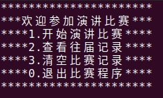

- [1.introduction](#1introduction)
- [2.SpeechManager class](#2speechmanager-class)
- [3.showMenu](#3showmenu)

# 1.introduction

&emsp;&emsp;黑马程序员的演讲比赛案例，主要应用到STL相关库中的方法。比赛规则如下：

- 共12人参加，比赛分两轮，第一轮为淘汰赛，第二轮为决赛；
- 每名选手都有对应的编号，如10001~10012；
- 比赛方式：分组比赛，每组6人；
- 第一轮分为两个小组，整体按照选手编号进行抽签顺序演讲；
- 十个评委分别给每名选手打分，去除最高分和最低分，求的平均分为本轮选手的成绩；
- 当小组演讲完后，淘汰组内排名最后的三个选手，前三名晋级，进入下一轮比赛；
- 第二轮为决赛，前三名胜出；
- 每轮比赛过后需要显示晋级选手的信息；

程序功能如下：
- 开始演讲比赛：完成整届比赛的流程，每个比赛阶段需要给用户一个提示，用户按任意键后进入下个阶段；
- 查看往届记录：查看之前比赛前三名的结果，每次比赛都会记录到文件中，文件用.csv后缀名保存；
- 清空比赛记录：将文件中数据清空；
- 退出比赛程序：可以退出当前程序；

# 2.SpeechManager class

功能描述：
- 提供菜单界面与 用户交互
- 对演讲比赛流程进行控制
- 与文件的读写交互

&emsp;&emsp;分别创建`speechManager.h`和`speechManager.cpp`

```cpp
#pragma once
#include <iostream>
#include <string>

class SpeechManager
{
public:
    // 构造函数
    SpeechManager();
    // 析构函数
    ~SpeechManager();
};
```

```cpp
#include "speechManager.h"

// 构造函数
SpeechManager::SpeechManager()
{
}

// 析构函数
SpeechManager::~SpeechManager()
{
}
```

# 3.showMenu

&emsp;&emsp;在`speechManager.h`中声明showMenu函数，在`speechManager.cpp`中添加实现。

```cpp
// 显示菜单
void showMenu();
```

```cpp
void SpeechManager::showMenu()
{
    std::cout << "**********************" << std::endl;
    std::cout << "***欢迎参加演讲比赛***" << std::endl;
    std::cout << "****1.开始演讲比赛****" << std::endl;
    std::cout << "****2.查看往届记录****" << std::endl;
    std::cout << "****3.清空比赛记录****" << std::endl;
    std::cout << "****0.退出比赛程序****" << std::endl;
    std::cout << "**********************" << std::endl;
    std::cout << std::endl;
}
```

